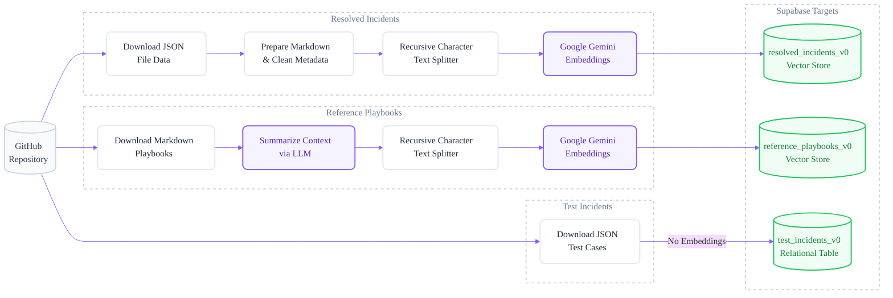
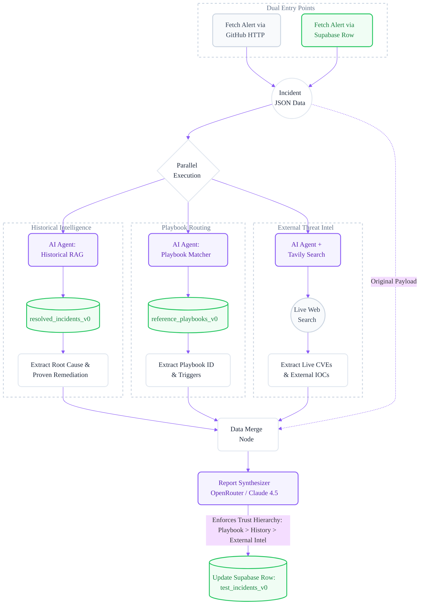

# 🚨 AI-Powered Incident Response Report Generator

> Generate a structured, source-attributed incident response report — with MITRE mapping, IOCs, severity calibration, and immediate action steps — within minutes of an alert firing. No manual playbook lookup, no hunting through past incidents, no Googling CVEs.

[](https://github.com/deployedengineer/incident-response)
[](https://n8n.io)
[](https://supabase.com)

**[📥 Import n8n Workflow](https://github.com/deployedengineer/incident-response/blob/main/Incident_Management_V0.json)** · **[📖 Deep Dive Docs](#-deep-dive-documentation)**

---

## 📋 Table of Contents

- [⚡ Time to Value](#-time-to-value)
- [🔥 The Problem](#-the-problem)
- [💡 The Solution](#-the-solution)
- [🧠 Where AI Is (and Isn't) Used](#-where-ai-is-and-isnt-used)
- [🏗️ Architecture](#%EF%B8%8F-how-it-works)
- [🛠️ Tech Stack](#%EF%B8%8F-tech-stack)
- [📁 What's in This Repo](#-whats-in-this-repo)
- [🚀 Quickstart](#-quickstart)
- [🔮 Next Version: Remediation Skills](#-next-version-remediation-skills)
- [📚 Deep Dive Documentation](#-deep-dive-documentation)
- [🎛️ Optional: Metadata Filtering](#%EF%B8%8F-optional-metadata-filtering)
- [🔧 Customisation](#-customisation)
- [⚠️ Known Limitations](#%EF%B8%8F-known-limitations)
- [📊 Evaluation](#-evaluation)
- [🤝 Contributing](#-contributing)
- [💬 Support](#-support)
- [📄 License](#-license)
- [🙏 Acknowledgments](#-acknowledgments)

---

## ⚡ Time to Value

| Goal                                                            | Time            |
| --------------------------------------------------------------- | --------------- |
| Import, configure credentials, trigger your first report        | **~5 minutes**  |
| Full setup: DB schema, ingest all sample data, run all 13 tests | **~10 minutes** |
| Swap in your own incidents, playbooks, and alerts for a PoC     | **A few hours** |

This is a working system on day one. No infrastructure to provision, no models to train, no code to write.

---

## 🔥 The Problem

When an incident fires at 3 AM, engineers face a critical bottleneck: **finding context fast**.

- **Context-switching overhead**: Manually searching Slack, Confluence, JIRA, and past incident docs takes 15–30 minutes before any real analysis begins.
- **Tribal knowledge loss**: The engineer who resolved a similar incident 6 months ago may be gone. Resolution strategies live in scattered notes, not in a searchable system.
- **Cognitive load at peak stress**: High-pressure triage leads to missed signals from past incidents that match the current pattern.
- **60% of incidents are repeats**: Industry data consistently shows the majority of incidents are variations of previously resolved issues — yet most teams solve them from scratch each time.

**The result:** Mean time to resolution (MTTR) averages 3–4 hours per incident without good tooling. With relevant context surfaced instantly, that drops to 45 minutes – 1.5 hours.

---

## 💡 The Solution

This system **automatically enriches every incident** with three parallel intelligence streams — within seconds of an alert firing:

1. **Historical intelligence** — retrieves the most similar past resolved incidents from your vector store and extracts proven remediation steps.
2. **Playbook routing** — semantically matches an appropriate reference playbook and surfaces its trigger conditions and immediate actions.
3. **Live threat intel** — uses Tavily to search for active CVEs, threat actor campaigns, and vendor advisories relevant to this specific incident.

The three streams are merged and synthesized by a final LLM into a single, structured triage report — written to your Supabase `test_incidents_v0` table.

**A typical output includes:**

- Severity calibration (corrected against NVD if scanner data is wrong)
- MITRE ATT&CK mapping (tactic + technique + prevention IDs)
- Root cause from historical matches with similarity scores
- Immediate action steps (first 10 minutes)
- IOC indicators from external research
- What Worked in past similar incidents

---

## 🧠 Where AI Is (and Isn't) Used

Understanding the AI boundary is critical for setting expectations and designing extensions responsibly.

### ✅ Where AI is used

| Component                               | What AI Does                                                                                                                                                                    |
| --------------------------------------- | ------------------------------------------------------------------------------------------------------------------------------------------------------------------------------- |
| **Historical RAG Agent**                | Generates a semantic query from the incident → retrieves similar past incidents → extracts and synthesizes root cause + remediation patterns                                    |
| **Playbook Routing Agent**              | Generates a semantic query → retrieves candidate playbooks → evaluates match quality and selects the best-fit playbook                                                          |
| **Threat Intel Agent**                  | Classifies the incident type → decides whether to search → executes Tavily searches → extracts CVE cards, IOC indicators, and phase-labelled mitigation steps                   |
| **Playbook Summarizer** (ingestion)     | Converts each raw reference playbook into a trigger-optimised semantic summary before embedding — improves retrieval accuracy significantly                                     |
| **Metadata Alignment Agent** (optional) | Maps test incident metadata to the nearest valid canonical values in your resolved incidents dataset — enables accurate metadata filtering                                      |
| **Final Synthesizer**                   | Merges all three intelligence branches into a single structured report, enforcing a content trust hierarchy: Playbook → Past Incidents → External Intel → General LLM reasoning |

### ❌ Where AI is NOT used

| What It Does NOT Do                         | Why This Matters                                                                                                                     |
| ------------------------------------------- | ------------------------------------------------------------------------------------------------------------------------------------ |
| Execute any remediation actions             | Every suggested action requires human review and approval before execution                                                           |
| Close or update tickets in external systems | There is no ticketing integration out of the box — that is intentional for v0                                                        |
| Make severity decisions autonomously        | Severity calibration is surfaced as a recommendation, not an automated action                                                        |
| Replace the on-call engineer                | The system produces a structured briefing. The human decides what to do.                                                             |
| Continuously monitor or auto-trigger        | Currently triggered manually or via Supabase loop — production auto-triggering requires a webhook from your SIEM or ticketing system |

> **Design principle:** The AI is strictly advisory. It surfaces context, surfaces patterns, and drafts a triage note. A human remains in the loop for every action.

---

## 🏗️ How It Works

### Ingestion Pipeline

Run these three ingestion workflows once (in any order) to seed your vector store:



> After all three ingestion pipelines complete, run `SELECT refresh_metadata_values_v0();` in your Supabase SQL editor to populate the metadata discovery table.

---

### Retrieval & Report Generation Pipeline

When a test incident is triggered, the workflow fans out into **three parallel retrieval branches**, merges the results, and synthesises a final report:



**Content trust hierarchy in the Synthesizer:** Playbook → Past incidents → External intel → General LLM reasoning. This ordering is enforced in the system prompt to minimise hallucination.

---

## 🛠️ Tech Stack

| Layer                 | Tool                                                                                  | Detail                                                  |
| --------------------- | ------------------------------------------------------------------------------------- | ------------------------------------------------------- |
| Orchestration         | [n8n](https://n8n.io)                                                                 | Self-hostable, all logic is visual                      |
| Vector DB             | [Supabase](https://supabase.com) + pgvector                                           | 3 tables: playbooks, resolved incidents, test incidents |
| Embeddings            | [Google AI Studio](https://aistudio.google.com) `gemini-embedding-001`                | 3072-dim vectors                                        |
| Retrieval agents      | [OpenRouter](https://openrouter.ai) (any model)                                       | Playbook selection + historical similarity scoring      |
| Synthesizer LLM       | [OpenRouter](https://openrouter.ai) (any model)                                       | Final structured report generation                      |
| External threat intel | [OpenRouter](https://openrouter.ai) (any model) + [Tavily Search](https://tavily.com) | Real-time CVE / threat actor / advisory lookup          |
| Data hosting          | GitHub                                                                                | All source data files live in this repo                 |

> **On tool categories:** Each tool above fills a specific architectural role. You can swap the implementation — e.g. use Pinecone instead of Supabase for the vector database, or Cohere embeddings instead of Gemini — but the category itself is required. See [Production Guide](./Production_Deployment_Guide.md) for swap guidance.

---

## 📁 What's in This Repo

```text
├── README.md                      # This documentation file
├── AI_Concepts_Deepdive.md        # AI architecture decisions and workflow testing results
├── Production_Deployment_Guide.md # Guide to deploying and customising this system
├── Incident_Management_V0.json    # The n8n workflow — import this
├── supabase_schema_v0.sql         # DB setup — run once in Supabase SQL editor
├── Reference Playbooks/           # 4 playbooks (brute force, phishing, phishing-campaign, S3 access)
├── Resolved Incidents/            # Past incident JSON — seeded into the vector store
├── Test Incidents/                # 13 synthetic test cases (data exfiltration, DDoS, ransomware, ...)
```

---

## 🚀 Quickstart

### Prerequisites

| Account                                         | Category                  | Our Choice                    | Free?                | Required?   |
| ----------------------------------------------- | ------------------------- | ----------------------------- | -------------------- | ----------- |
| [Supabase](https://supabase.com)                | Vector Database           | Supabase + pgvector           | ✅ Yes               | ✅ Required |
| [Google AI Studio](https://aistudio.google.com) | Embedding Model           | Gemini `gemini-embedding-001` | ✅ Yes (rate limits) | ✅ Required |
| [OpenRouter](https://openrouter.ai)             | LLM Routing               | OpenRouter                    | Pay-per-token        | ✅ Required |
| [Tavily](https://tavily.com)                    | Web Search / Threat Intel | Tavily                        | ✅ 1,000/month free  | ✅ Required |
| [n8n](https://n8n.io)                           | Workflow Engine           | n8n                           | ✅ Self-host free    | ✅ Required |

---

### Step 1 — Database Setup

Run `supabase_schema_v0.sql` in your Supabase SQL editor. This creates:

- `resolved_incidents_v0` — vector store for past incidents
- `reference_playbooks_v0` — vector store for playbooks
- `test_incidents_v0` — structured table for incoming alerts and generated reports
- `metadata_values_v0` — tracks distinct metadata field values (used for optional metadata filtering)
- Helper functions: `match_resolved_incidents_v0`, `match_reference_playbooks_v0`, `refresh_metadata_values_v0`

> **Note:** The `SELECT refresh_metadata_values_v0()` call at the end of the schema is a placeholder. Run it **after** completing Step 3 (data ingestion), not during initial schema setup.

---

### Step 2 — Import the n8n Workflow

Download and import [`Incident_Management_V0.json`](./Incident_Management_V0.json) into your n8n instance via **Workflows → Import from file**.

Then add four credentials in n8n (**Settings → Credentials**):

| Credential        | Used for                                   |
| ----------------- | ------------------------------------------ |
| Supabase API      | DB reads/writes + vector store             |
| Google Gemini API | Embedding generation                       |
| OpenRouter API    | LLM calls (retrieval agents + synthesizer) |
| Tavily API        | External threat intel search               |

---

### Step 3 — Ingest Data

The workflow contains three separate ingestion pipelines, each triggered manually:

1. **Ingest Resolved Incidents** — fetches `Resolved Incidents/` from GitHub → embeds → writes to `resolved_incidents_v0`
2. **Ingest Reference Playbooks** — fetches `Reference Playbooks/` from GitHub → summarises → embeds → writes to `reference_playbooks_v0`
3. **Ingest Test Incidents** — fetches `Test Incidents/` from GitHub → writes (no embedding) to `test_incidents_v0`

After all three complete, run this once in Supabase SQL editor:

```sql
SELECT refresh_metadata_values_v0();
```

This populates `metadata_values_v0` with all distinct field values from your resolved incidents — severity levels, incident types, affected systems, MITRE IDs, etc. Required only if you plan to enable optional metadata filtering.

---

### Step 4 — Trigger a Report

Two modes are supported:

**Mode A — GitHub-direct** _(simpler, no Supabase row needed)_
Trigger the retrieval workflow with a test incident ID (e.g. `Test-data_exfiltration-001.json`). The workflow fetches the incident JSON directly from GitHub and runs the full pipeline.

**Mode B — Supabase-loop** _(recommended for evaluation)_
After ingesting test incidents (Step 3), trigger the Supabase-based retrieval path. The workflow fetches the incident row from `test_incidents_v0`, runs the pipeline, and writes the generated report back to the `output` column of the same row. This lets you compare all 13 outputs in one place.

---

## LLM Configuration

The default model is **Claude Opus 4.5** (`anthropic/claude-opus-4.5`) via OpenRouter. Change it in the model selector of any node — no other code changes required.

**Recommended models:**

| Type          | Model                         |
| ------------- | ----------------------------- |
| Closed source | `anthropic/claude-sonnet-4.5` |
| Closed source | `anthropic/claude-opus-4.5`   |
| Closed source | `openai/gpt-5.2`              |
| Closed source | `google/gemini-3-pro-preview` |
| Open source   | `moonshotai/kimi-k2.5`        |
| Open source   | `qwen/qwen3.5-plus-02-15`     |
| Open source   | `z-ai/glm-4.7`                |

---

## 🔮 Next Version: Remediation "Skills"

The v0 system is a **read-only intelligence layer** — it surfaces context and recommendations but takes no actions.

The planned v1 extension introduces **Remediation Skills**: pre-built n8n sub-workflows that can be triggered by the triage report to _execute_ the suggested actions. Think of them as runbooks that can be run, not just read.

**Example Skills being designed for v1:**

| Skill                | What It Does                                                             |
| -------------------- | ------------------------------------------------------------------------ |
| `isolate-endpoint`   | Calls an EDR API (CrowdStrike, SentinelOne) to isolate the affected host |
| `revoke-credentials` | Revokes a specific IAM role or API key via cloud provider SDK            |
| `block-ip`           | Pushes a block rule to your WAF or firewall via API                      |
| `notify-slack`       | Posts a formatted alert to a Slack channel with the generated report     |
| `send-email`         | Sends a structured incident summary email to the response team           |
| `create-ticket`      | Creates a ticket in Jira/ServiceNow with the report as the description   |

**Design principle:** Skills are optional, human-approved before execution, and composable. The AI generates the recommendation; the skill provides the execution mechanism. Skills can also be chained — e.g. `isolate-endpoint` → `notify-slack` → `create-ticket`.

If you have a specific skill you'd like to contribute or request, open an issue.

---

## 📚 Deep Dive Documentation

For readers who want to go further than the quickstart:

| Document                                                        | What's Inside                                                                                                                                                                                                                                                        |
| --------------------------------------------------------------- | -------------------------------------------------------------------------------------------------------------------------------------------------------------------------------------------------------------------------------------------------------------------- |
| [AI Concepts Deep Dive](./AI_Concepts_Deepdive.md)              | Testing different models (LLM-only vs RAG vs Search), hallucination analysis, why RAG + Search beat either alone, model recommendations by use case                                                                                                                  |
| [Production Deployment Guide](./Production_Deployment_Guide.md) | Customising the data schema and metadata fields, swapping embedding models, adding hybrid search, integrating threat intel APIs (NVD, VirusTotal, CISA KEV), connecting real ticketing systems, MITRE ATT&CK ticket format requirements for production effectiveness |

---

## 🎛️ Optional: Metadata Filtering

By default, the historical incidents retrieval runs **without metadata filters** (pure semantic similarity). The workflow also contains an alternative retrieval path **with metadata filtering** — currently disabled.

To switch:

1. In n8n, locate the `Historical Incidents RAG` branch
2. Disable the no-filter node, enable the metadata-filter node
3. The metadata filter agent will use `metadata_values_v0` to dynamically select relevant filters (e.g., match only incidents of the same `type` or `severity`)

This path becomes more effective as your resolved incidents dataset grows (100+ incidents is a reasonable starting point for meaningful metadata filtering).

---

## 🔧 Customisation

- **Add playbooks** — drop a Markdown file into `Reference Playbooks/`, re-run the playbook ingestion workflow
- **Add real incidents** — ingest resolved incidents from your SIEM or ticketing system using the same JSON schema as `Resolved Incidents/`
- **Edit the report format** — the Synthesizer system prompt is editable directly in the n8n node; every section and rule is documented inline
- **Enrich historical data** — the `remediation_actions` field in resolved incidents directly powers the "What Worked" section; more specific data here = more useful reports
- **Swap the embedding model** — change the Google Gemini Embeddings node model name (see [AI Concepts Deep Dive](./AI_Concepts_Deepdive.md) for model tradeoffs)

---

## ⚠️ Known Limitations

- **Bring your own ticketing** — no native ticketing integration (Jira, PagerDuty, ServiceNow) out of the box - designed to be used with your own ticketing system
- **4 specific playbooks** — brute force, phishing, S3 data access, phishing campaign. All other incident types fall back to the generic playbook
- **Synthetic resolved incidents** — the sample `Resolved Incidents/` data has generic `remediation_actions` fields. Replacing these with real incident data from your environment will significantly improve the "What Worked" section of the report
- **Evaluated on 13 test cases** — avg score 9.35/10 across the test set; not a formal benchmark on production data

---

## 📊 Evaluation

13 synthetic test cases covering: data exfiltration, DDoS, error spike, leaked credentials, malware, memory leak, phishing, policy violation, prompt injection, ransomware, service outage, C2/network anomaly, and vulnerable dependency (Log4Shell).

Average score: **9.35 / 10** across all test cases.

For a full breakdown of what was tested, how models were evaluated, and where they failed, see the [AI Concepts Deep Dive](./AI_Concepts_Deepdive.md).

---

## 🤝 Contributing

Contributions are welcome. The most valuable things to contribute:

- **Reference playbooks** — add a Markdown playbook for an attack type not currently covered
- **Resolved incident schemas** — share anonymised incident templates to improve the sample dataset
- **New retrieval configs** — if you test a RAG configuration not covered in the AI Concepts Deep Dive, open a PR with your analysis
- **Remediation skills** — pre-built n8n sub-workflows that execute triage actions (see [Next Version: Remediation Skills](#-next-version-remediation-skills))

**To contribute:**

1. Fork the repository
2. Create a feature branch (`git checkout -b feature/your-feature-name`)
3. Make your changes and test them against the sample test cases
4. Open a pull request with a description of what you changed and why

For questions before contributing, open a [GitHub Discussion](https://github.com/deployedengineer/incident-response/discussions) or check the open issues.

---

## 💬 Support

| Channel                                                                                 | Use For                                                  |
| --------------------------------------------------------------------------------------- | -------------------------------------------------------- |
| [GitHub Issues](https://github.com/deployedengineer/incident-response/issues)           | Bug reports, feature requests                            |
| [GitHub Discussions](https://github.com/deployedengineer/incident-response/discussions) | Setup questions, workflow customisation, sharing results |

Before opening an issue, please check the [Known Limitations](#%EF%B8%8F-known-limitations) and [AI Concepts Deep Dive](./AI_Concepts_Deepdive.md) — most common questions are answered there.

---

## 📄 License

MIT License — see [LICENSE](./LICENSE) for full terms.

You are free to use, modify, and distribute this project for commercial or non-commercial purposes. Attribution appreciated but not required.

---

## 🙏 Acknowledgments

This project builds on:

- **[n8n](https://n8n.io)** — the workflow automation backbone that makes multi-model orchestration accessible without writing a backend
- **[Supabase](https://supabase.com)** — for making `pgvector` production-ready with a simple hosted interface
- **[MITRE ATT&CK](https://attack.mitre.org)** — the shared vocabulary that makes incident metadata portable and comparable
- **[Tavily](https://tavily.com)** — for real-time threat intel search that doesn't require building a scraper pipeline
- **[Voyage AI](https://www.voyageai.com)** and **[Cohere](https://cohere.com)** — for best-in-class embedding and reranking APIs referenced in the production upgrade path
